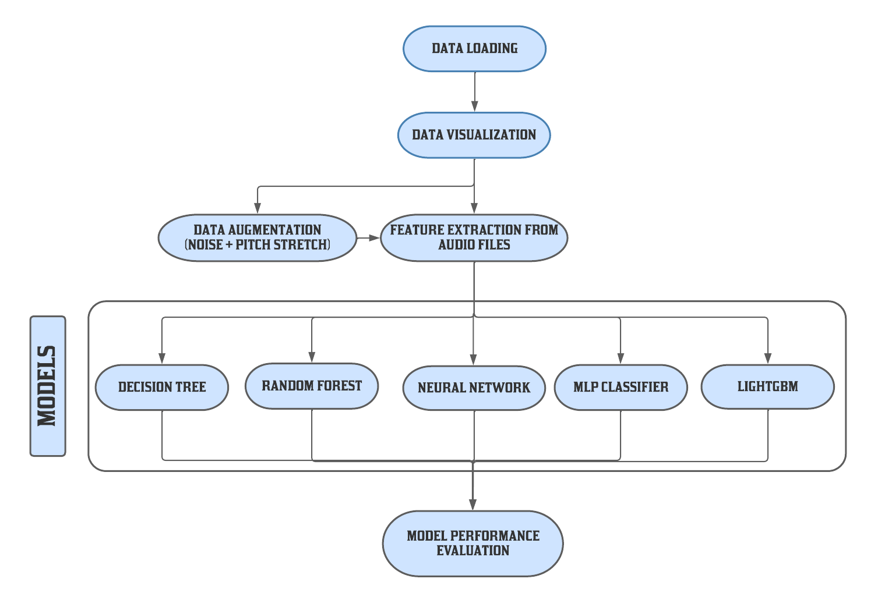

# Objective
This project tries to predict the emotion of the user based on how he/she speaks in realtime and can also be used to predict emotion of a recorded audio file.
We have used standard Machine Learning (ML) model for this prediction. [Colab File](Project_Speech_Emotion_Classification.ipynb) for reference.
# Highlights
1) Used librosa (a python package) for numerical audio feature extraction and visualization. 
  
  
3) Implemented an end to end machine learning pipeline.


  

5) Compared performance of various models used for prediction.

  

6) Deployed the pipeline on streamlit (a web interface).
# How to Run the Code
1)Make sure all the dependencies are dowloaded librosa,numpy,streamlit,lightgbm and pyaudio and for pyaudio install using pipwin.

2)After installing open [main.py](main.py) file 

3)Now run the command on terminal
```
streamlit run main.py
```
Now a localhost will open a browser tab and then you can use that to run the Speech Emotion Recognition on both recorded as well as pre-recorded audio files.
